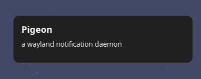

# pigeon

A notification daemon that aims to be a memory efficient and highly customizable.

<p align="center">
  
</p>

## Installation

```
cargo install --git https://github.com/lisk77/pigeon
```

## Usage

To simply start the daemon use

```
pigeon serve
```

To switch a profile use 

```
pigeon profile set <PROFILE>
```

## Configuration

Pigeon uses a profile system where you can define style overrides in general or based on rules. The base look of pigeon can be found with `pigeon config default`. 

```toml
[profiles.study]
default_action = "block"
```

This configures the `study` profile to block notifications by default. Profiles are also created implicitly when a rule or style override is defined under `profiles.study`.

If we now want to allow specific notifications like emails, we define a rule.

```toml
[[profiles.study.rules]]
action = "allow"
category = "email"
```

This will display all notifications that have a hint saying they are of category "email". Any style overrides like this

```toml
[profiles.study.rules.notification]
color = "#ff0000"
```

will be associated with the rule above. If you want a general style override for the specific profile, you need to add that below the profile definition. Rules are always checked in order, meaning the first rule that matches will be applied.

To now actually apply this profile we can either use `pigeon profile set study` or define it in the profile table.

```toml
[profile]
active = "study"
```

The daemon will also recognize the `x-pigeon-profile` hint and set the profile for this notification to the specified profile (as long as it exists and defined properly). For this you need to allow the profile override as well.

```toml
[profile]
active = "study"
allow_profile_override = true
```

## History

The History is disabled by default. To enable either set this value

```toml
[history]
enabled = true
```

or use this command

```
pigeon history enable
```

It also works with the profile system

```toml
[profiles.study.history]
enabled = false

[[profiles.study.rules]]
app_name = "mail"

[profiles.study.rules.history]
enabled = true
```
